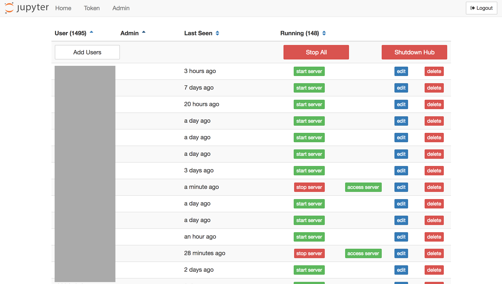

## Unresponsive Notebook

Try restarting the kernel if you have errors related to execution of code, such as the notebook not running properly.

### Restarting the Kernel

If your notebook becomes unresponsive, you can try to restart the kernel.


### Restarting Your Own Server

All users can restart their own servers. To do so, start by going to the control panel.

Click the `Stop My Server` button.

Once the server has stopped and the `Stop My Server` button is no longer visible, click the `My Server` button to restart the server.


### Restarting Student Servers

Users with admin privileges on DataHub can restart other users' servers. To restart a student's server, first go to the control panel.


Click on the `Admin` button at the top of the page. If you do not see this button, you do not have admin rights. To request admin rights, please [post on Piazza](http://piazza.com/berkeley/other/cs97).


After clicking the `Admin` button, you will see the admin panel. Usernames have been obfuscated here. To search for a user, you can use find \(type Control+F or Command+F\). An individual's username is the same as their CalNet ID. When you have found the desired user, click the `stop server` button in the user's row.



After clicking the `stop server` button, you can click the `start server` button in the user's row.

#### Troubleshoot issues with Hub/Server/Code running slow

**What should I do if my hub is running slow?**

Try these recommended options,

- Restart your kernel.

- Check whether there are lot of open tabs? If yes, close the tabs that are not required.

If you still face the issue, raise a [bug](https://github.com/berkeley-dsep-infra/datahub/issues/new?assignees=&labels=bug&template=bug_report.yml)!

**What should I do if my code is running slow?**

In general, this issue could be attributed to the varied programming practices adopted that might have slowed the operation of the hub. Check whether your code does any of the following, 

- You are running an infinite loop 
- Your computation/calculation is big 
- You are joining tables that are too large
- You have too many notebooks open at the same time
- You are trying to show a table which is too large and as a result are crashing the browser

If they are relevant, try fixing these issues by improving the programming practices or by reducing the size of the dataset. If none of the highlighted points seem relevant in your scenario, Please raise a [bug request](https://github.com/berkeley-dsep-infra/datahub/issues/new?assignees=&labels=bug&template=bug_report.yml)!

### 4xx and 5xx errors

A user's Lab workspace might become unusable (e.g. it opens a notebook or workspace that is impossible to get out of). You have couple of options before you escalate this issue to us:

- Start the user's server by visiting `{hub-url}/user/{username}/lab/workspaces/lab?reset` to reset the workspace.(Refer to this [documentation](https://jupyterlab.readthedocs.io/en/stable/user/urls.html#resetting-a-workspace) to reset the workspace for the users.
- Limit the environment to the user's file browser by visiting `{hub-url}/user/{username}/tree` in Jupyter Notebook.
- Launch a terminal by visiting `{hub-url}/user/{username}/terminals/N` (where `N` is any integer) in Jupyter Notebook. A terminal is useful if one needs to recover from an nbgitpuller issue or run other troubleshooting commands.
- If none of the above options work, Log into the [admin panel](https://datahub.berkeley.edu/hub/admin#/). Search for the calnet id of the user you want to troubleshoot. Click "Edit User" option and cLick on "Delete User" button which results in user getting deleted from the chosen hub. Now, Select the option "back" to go back to admin dashboard. Select "Add Users" option, Add the username (calnet id) and click on the "Add Users" button. Users will be added back to the admin interface. You can either check their instance or ask them to check their instance manually to confirm that the hack worked.

**What if restarting the kernel is not solving spawn pending error message?**

You can check if the output files are causing the ipynb files (in the case of python notebooks) to be bloated. If that be the case then you can run the following command to clear the output files which is causing this issue.

```python
jupyter nbconvert --clear-output --inplace filename.ipynb
```

**What should I do if I get "503 service unavailable error" regularly?**

Sorry, that you had to face this error! This error could be due to some of our stability improvements. Try restarting your server and wait for few minutes to see whether the issue still persists. If yes, raise a github [issue](https://github.com/berkeley-dsep-infra/datahub/issues/new/choose).

**What should I do if I get "403 errors: Blocking request from unknown origin" regularly?**

Sorry, that you had to face this error! This error could be due to multiple reasons outlined below, 

- You are using email id with a different domain other than berkeley.edu to authenticate with DataHub which could have potentially raised this error. Raise a github [issue](https://github.com/berkeley-dsep-infra/datahub/issues/new?assignees=&labels=bug&template=bug_report.yml), so that we can authorize your domain.

- Large number of your students are trying to use the service resulting in failure of certain nodes. We are working on improving how we scale the hub with large volume of users.

Raise a github [issue](https://github.com/berkeley-dsep-infra/datahub/issues/new?assignees=&labels=bug&template=bug_report.yml)!

**What should I do if I get an “An unknown error occurred while loading this notebook” as part of the datahub service?**

Try opening a new terminal from your instance and run the following command, 

```python
rm -f ~/.local/share/jupyter/nbsignatures.db
```

If the error still persists, raise a github [issue](https://github.com/berkeley-dsep-infra/datahub/issues/new?assignees=&labels=bug&template=bug_report.yml).

### Kernels Dying

Kernel deaths are a common result of your server running out of memory. As soon as you exceed your memory allocation, your kernel most probably will die because of the lack of availability of virtual memory or swap space. It is most likely due to a bug in your code.

## Close JupyterLab Features

. In Jupyter Lab, click the icon at the far left depicting a square within a circle. It displays open tabs, running kernels and language servers, and open terminals. Hover your mouse over any entry and a close icon (X) will appear. Click on the close icon to shut down that entry.

